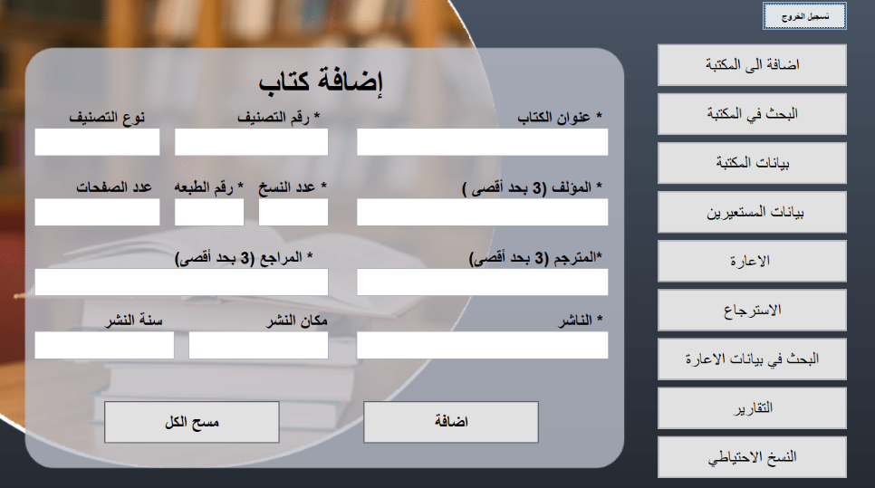

# Library-Program

This is a library program that provides services of borrowing and retrieving books from the library.

# Program Interfaces

The program has three users, each user has a specific scope of functions.

This is the home interface that shows the menu of the program functions.

This interface will appear to add a new book to the library.

